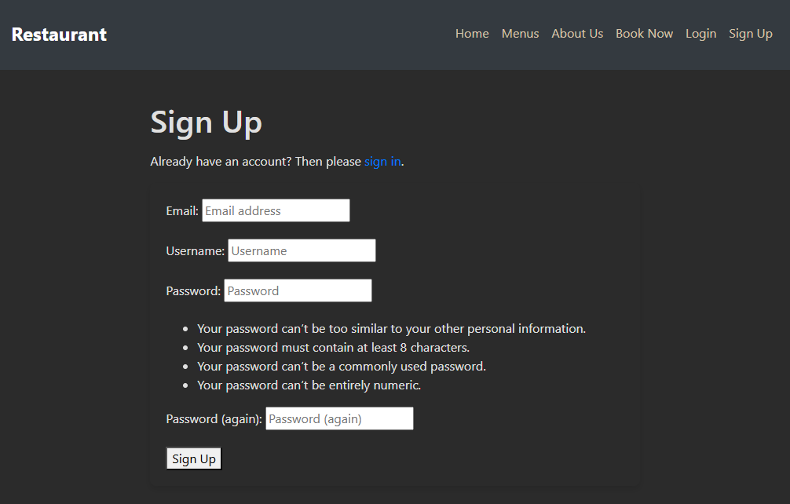
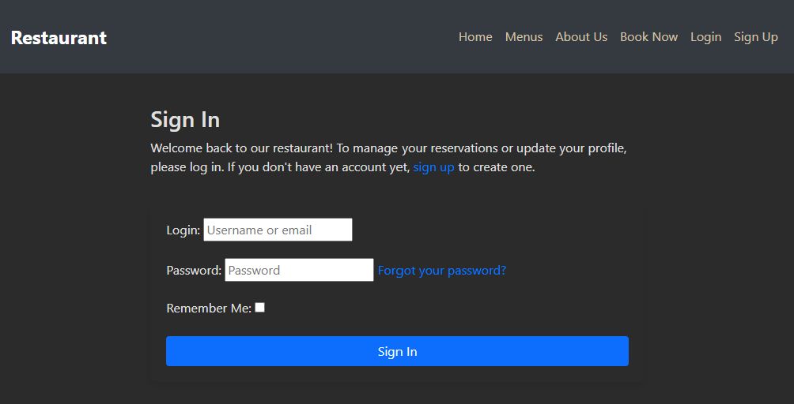
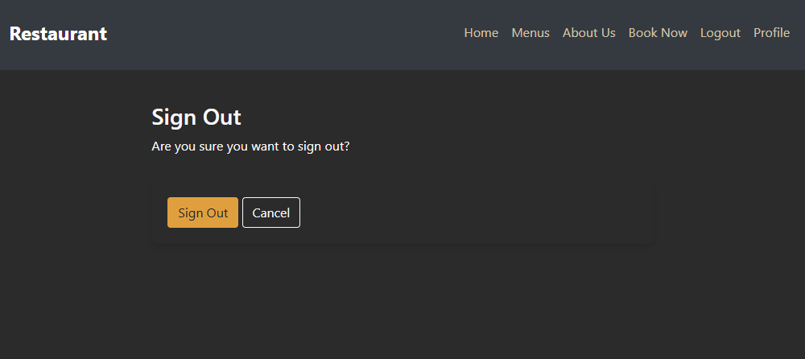
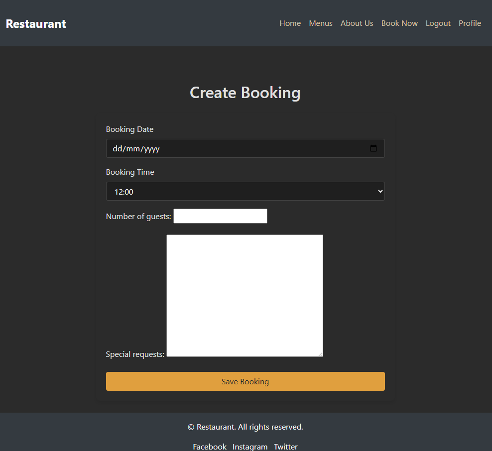
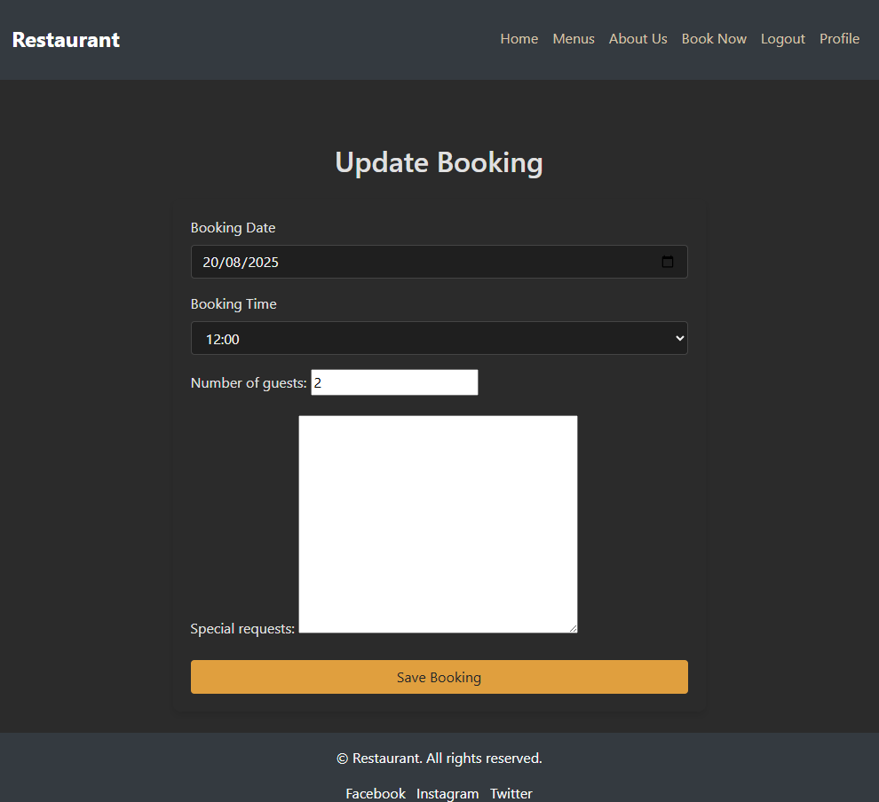
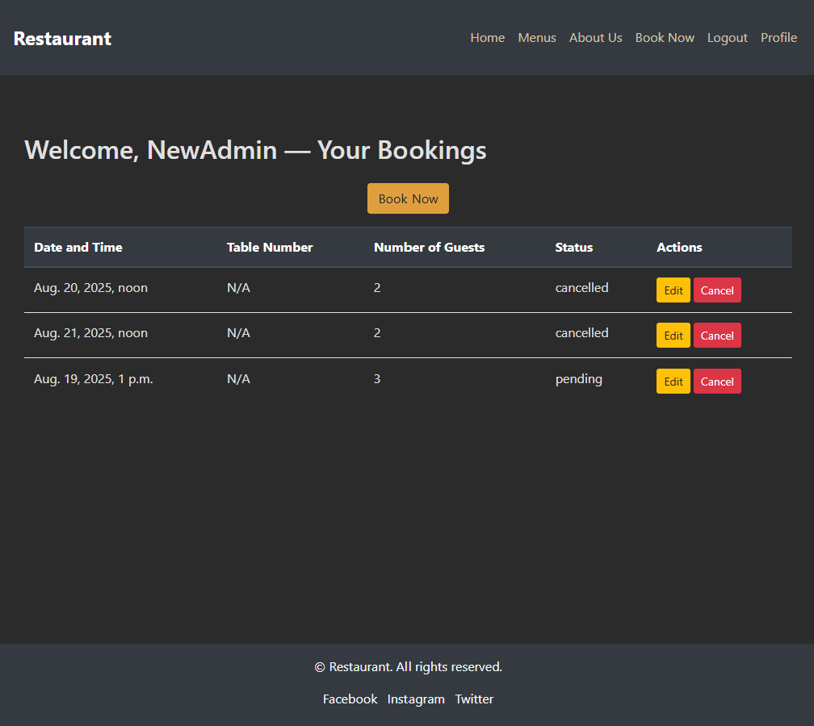
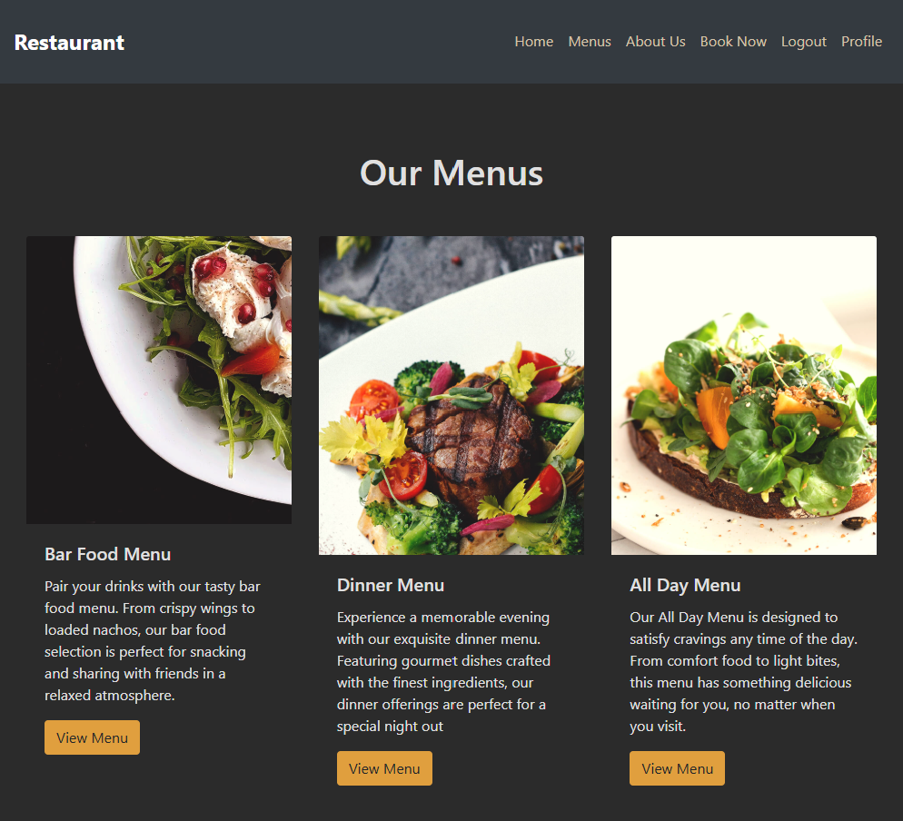
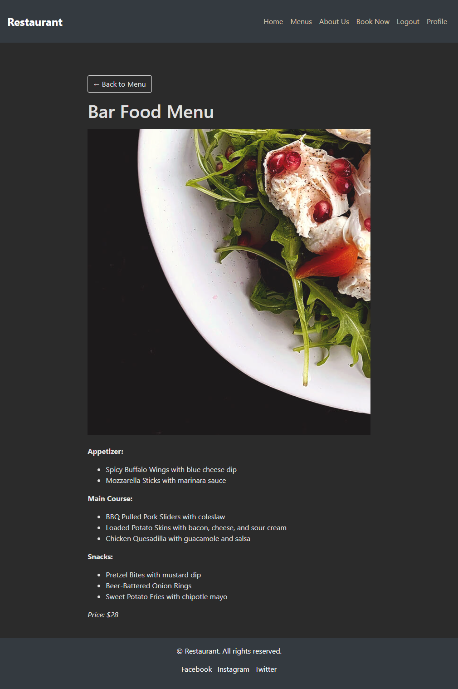
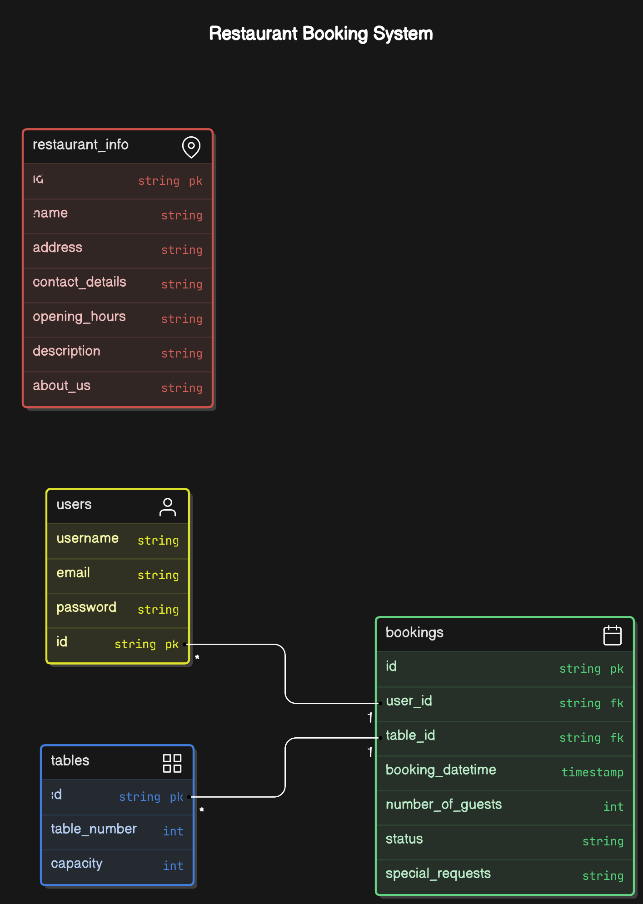

# Restaurant Booking App

A full-stack Django web application for managing restaurant reservations.  
Built as part of the Code Institute Full Stack Software Development course (Portfolio Project 4).

Deployed site: [Heroku Link](https://pp4-restaurant-booking-app-7cc89317a653.herokuapp.com)  
Repository: [GitHub Repo](https://github.com/denisechendd/Restaurant_APP_Django.git)

---

## Table of Contents

- [Project Overview](#project-overview)
- [UX / Design](#ux--design)
  - [Strategy](#strategy)
  - [Scope](#scope)
  - [Structure](#structure)
  - [Surface](#surface)
- [Features](#features)
- [Data Model](#data-model)
- [Agile Methodology](#agile-methodology)
- [Testing](#testing)
- [Technologies Used](#technologies-used)
- [Deployment](#deployment)
- [Credits](#credits)
- [Acknowledgements](#acknowledgements)

---

## Project Overview

The Restaurant Booking App allows users to:

- Create an account and log in securely.
- Make, update, and cancel bookings.
- View current bookings in a responsive table.
- Browse the restaurant menu.

Site owners can:

- Manage bookings in the Django admin.
- Moderate menu items.
- Control booking confirmation and table allocation.

---

## UX / Design

### Strategy

The app was designed for:

- **Customers** who want a quick way to reserve tables online.
- **Restaurant staff** who need a reliable admin interface.

### Scope

- Core booking CRUD functionality.
- Authentication with Django Allauth.
- Responsive design for mobile-first use.

### Structure

Navigation is consistent across all pages:

- Home
- Menu
- Bookings (Profile)
- Login/Logout/Signup

### Surface

- **Colours**: Neutral background with an orange accent (#e09f3e) for CTAs.
- **Typography**: Bootstrap defaults (clean and readable).
- **Accessibility**: High-contrast buttons, semantic HTML.

## Features

### Implemented

- **Authentication**: signup, login, logout.
- **Bookings CRUD**:
  - Create booking (date/time validation).
  - View bookings table.
  - Update booking (status resets to pending).
  - Cancel booking.
- **Menu browsing** with Back button on detail pages.
- **Profile welcome message** with logged-in user’s name.
- **Sticky footer** on all pages.










### Future Features

- Email confirmations/reminders.
- Staff dashboard with analytics.
- Event/special menu support.

---

## Data Model

The main model is **Booking** with fields:

- `user`
- `booking_datetime`
- `number_of_guests`
- `status`
- `table`
- `special_requests`

Relationships:

- One User → Many Bookings.
- Bookings may be linked to Tables.



---

## Agile Methodology

The project was managed using Agile principles:

- User stories captured in GitHub Projects.
- Tasks moved across _To Do → In Progress → Review → Done_.
- Iterative development with frequent testing.

---

## Testing

### Manual Testing

Each feature was manually tested.

Example (Bookings CRUD):

| Feature              | Action                 | Expected Result                 | Actual Result     | Pass/Fail |
| -------------------- | ---------------------- | ------------------------------- | ----------------- | --------- |
| Create booking       | Select valid date/time | Booking created                 | Works as expected | ✅        |
| Prevent past booking | Select past date       | Error shown                     | Works as expected | ✅        |
| Edit booking         | Change guests          | Booking updates & status resets | Works as expected | ✅        |
| Cancel booking       | Click cancel           | Booking removed                 | Works as expected | ✅        |

This document records the manual testing process for the Restaurant Booking App.  
It follows the structure required by the Code Institute assessment criteria.

---

## Table of Contents

- [User Story Testing](#user-story-testing)
- [Feature Testing](#feature-testing)
- [Validator Testing](#validator-testing)
- [Responsiveness Testing](#responsiveness-testing)
- [Browser Compatibility](#browser-compatibility)
- [Known Issues / Bugs](#known-issues--bugs)

---

## User Story Testing

| User Story                            | Expected Behaviour                 | Action Taken             | Result                  | Pass/Fail |
| ------------------------------------- | ---------------------------------- | ------------------------ | ----------------------- | --------- |
| As a new user, I want to sign up      | I can register with email/username | Went to /accounts/signup | Account created         | ✅        |
| As a user, I want to log in           | I can log in and see bookings      | Used login form          | Redirected to profile   | ✅        |
| As a user, I want to make a booking   | Select date/time, guests           | Submitted booking form   | Booking appears in list | ✅        |
| As a user, I want to cancel a booking | Cancel button removes booking      | Clicked Cancel           | Booking deleted         | ✅        |
| As a user, I want to edit a booking   | I can change guests/time           | Edited booking           | Status reset to pending | ✅        |

---

## Feature Testing

### Authentication

| Feature  | Action       | Expected Result      | Actual Result | Pass/Fail |
| -------- | ------------ | -------------------- | ------------- | --------- |
| Signup   | Fill form    | Account created      | Works         | ✅        |
| Login    | Fill form    | Logged in            | Works         | ✅        |
| Logout   | Click logout | Redirected home      | Works         | ✅        |
| Redirect | Log in       | Redirect to bookings | Works         | ✅        |

### Bookings

| Feature              | Action          | Expected Result | Actual Result | Pass/Fail |
| -------------------- | --------------- | --------------- | ------------- | --------- |
| Create booking       | Valid date/time | Booking saved   | Works         | ✅        |
| Prevent past booking | Enter past date | Error message   | Works         | ✅        |
| Edit booking         | Update guests   | Status reset    | Works         | ✅        |
| Cancel booking       | Click cancel    | Booking removed | Works         | ✅        |

### Menu

| Feature     | Action     | Expected Result           | Actual Result | Pass/Fail |
| ----------- | ---------- | ------------------------- | ------------- | --------- |
| Menu list   | Visit page | Menu items displayed      | Works         | ✅        |
| Menu detail | Click item | Item detail + back button | Works         | ✅        |

---
## Responsiveness Testing

Tested using Chrome DevTools and real devices.

| Device         | Page      | Result |
| -------------- | --------- | ------ |
| iPhone X       | Home      | ✅     |
| iPhone X       | Bookings  | ✅     |
| iPad           | Menu      | ✅     |
| Windows Laptop | All pages | ✅     |

---

## Browser Compatibility

| Browser | Version | Result |
| ------- | ------- | ------ |
| Chrome  | Latest  | ✅     |
| Edge    | Latest  | ✅     |
| Firefox | Latest  | ✅     |
| Safari  | iOS     | ✅     |

---

## Known Issues / Bugs

- [ ] Signup form styling could be further polished.
- [ ] High-contrast button colours still need design refinement.

---

### Validator Testing

- **HTML**: W3C Validator → Pass.
- **CSS**: Jigsaw Validator → Pass.
- **Python**: flake8 → Pass.
- **Accessibility**: Lighthouse audit → Good contrast and structure.

### Responsiveness

Tested on:

- Chrome DevTools (mobile + tablet + desktop).
- Real devices (Android + Windows laptop).

Results: layout adapts, footer sticky, no horizontal overflow.

### Bugs Fixed

- **Naive vs Aware datetime bug** → fixed with timezone-aware validation.
- **Floating footer** → fixed with flexbox layout.
- **Low contrast auth forms** → styled in `fixes.css`.

---

## Technologies Used

- Django 4.2
- Bootstrap 4
- PostgreSQL (Heroku) / SQLite (dev)
- Cloudinary (media storage)
- Django Allauth (auth)
- Django Summernote (content editor)
- Heroku (deployment)

---

## Deployment

### Local Deployment

1. Clone repo:
   ```bash
   git clone https://github.com/denisechendd/Restaurant_APP_Django.git
   cd Restaurant_APP_Django
   ```
2. Install dependencies:
   ```bash
   pip install -r requirements.txt
   ```
3. Create `env.py` with variables:
   ```python
   import os
   os.environ["SECRET_KEY"] = "your_secret_key"
   os.environ["DEBUG"] = "1"
   os.environ["DATABASE_URL"] = "sqlite://..."
   ```
4. Run migrations:
   ```bash
   python manage.py migrate
   ```
5. Run server:
   ```bash
   python manage.py runserver
   ```

### Heroku Deployment

1. Create Heroku app & link GitHub repo.
2. Set Config Vars:
   - `SECRET_KEY`
   - `DATABASE_URL`
   - `CLOUDINARY_CLOUD_NAME`, `CLOUDINARY_API_KEY`, `CLOUDINARY_API_SECRET`
   - `DEBUG=0`
   - `ALLOWED_HOSTS=.herokuapp.com,localhost,127.0.0.1`
3. Deploy via GitHub → Heroku.
4. Run migrations on Heroku:
   ```bash
   heroku run python manage.py migrate
   ```

---

## Credits

- Bootstrap docs for layout.
- Cloudinary for media hosting.
- Code Institute course material.
- Stack Overflow & Django docs for bug fixes.
- Favicon assets from [favicon.io](https://favicon.io/).

---

## Acknowledgements

Thanks to Code Institute mentors, assessors, and peers for support during development.
