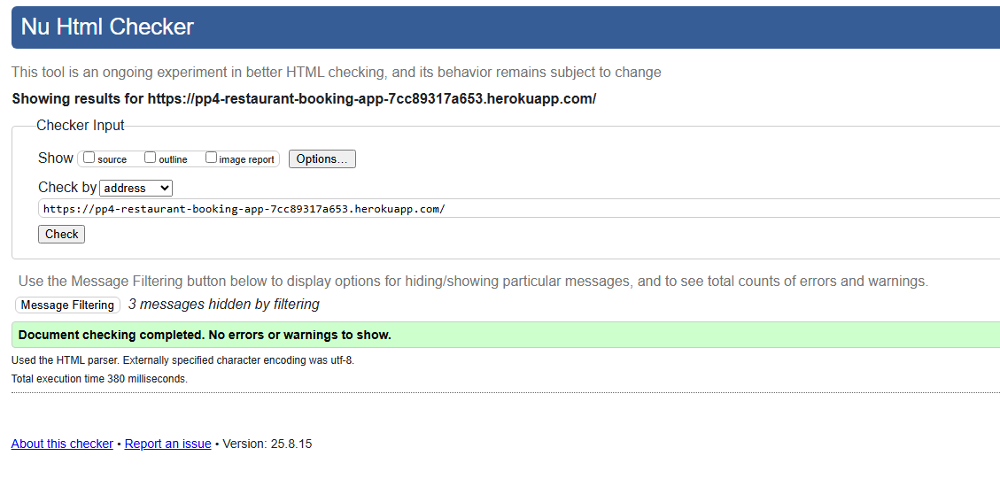
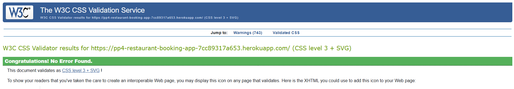
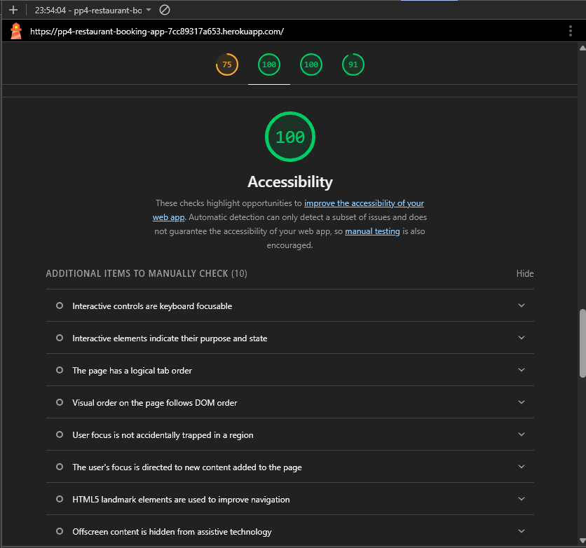

# TESTING

This document records automated and manual testing for the **Restaurant Booking App**.

Live site: https://pp4-restaurant-booking-app-7cc89317a653.herokuapp.com/  
Repository: https://github.com/Bear81/restaurant_booking

---

## Contents
- [Test Environment](#test-environment)
- [Automated Tests](#automated-tests)
- [Manual Tests](#manual-tests)
  - [Authentication](#authentication)
  - [Bookings](#bookings)
  - [Menu](#menu)
  - [Navigation & Layout](#navigation--layout)
- [Validator Reports](#validator-reports)
- [Accessibility](#accessibility)
- [Responsiveness & Devices](#responsiveness--devices)
- [Browser Compatibility](#browser-compatibility)
- [Known Issues](#known-issues)
- [Bug Fix Log](#bug-fix-log)

---

## Test Environment

- **Backend:** Django 4.2 (Python 3.10)  
- **DB:** PostgreSQL (Heroku) / SQLite (local)  
- **Media:** Cloudinary  
- **Browsers used:** Chrome (latest), Edge (latest), Firefox (latest)
- **Devices used:** Windows laptop, Android phone, iPad (simulated with DevTools)

Local setup:
```bash
pip install -r requirements.txt
python manage.py migrate
python manage.py runserver
```

---

## Automated Tests

Run test suite:
```bash
python manage.py test
```

Run flake8 (style):
```bash
flake8 --count --statistics --show-source .
```

- Flake8 results screenshot:  
  

> If any tests fail, record failing cases below with steps to reproduce and resolution.

---

## Manual Tests

Record objective steps and outcomes. Use ✅ / ❌.

### Authentication

| Feature | Steps | Expected | Actual | Result |
|---|---|---|---|---|
| Signup | Go to `/accounts/signup`, complete form, submit | Account created, redirect to bookings/profile |  |  |
| Login | `/accounts/login`, submit valid credentials | Redirect to bookings/profile |  |  |
| Logout | Click Logout | Redirect to home, session cleared |  |  |
| Redirect after login | Login from any page | Redirects to **My Bookings** |  |  |

### Bookings

| Feature | Steps | Expected | Actual | Result |
|---|---|---|---|---|
| Create booking | Open **Book Now**, select future date/time, guests, submit | Booking visible in list |  |  |
| Prevent past date | Select past date/time | Error message, no save |  |  |
| Edit booking | Click **Edit**, change guests/time, submit | Booking updated, **status reset to pending** |  |  |
| Cancel booking | Click **Cancel** | Booking removed from list |  |  |
| Empty state CTA | No bookings exist | “Create booking” CTA visible |  |  |

### Menu

| Feature | Steps | Expected | Actual | Result |
|---|---|---|---|---|
| Menu list | Visit **Menu** | Menu items displayed in cards/list |  |  |
| Menu detail | Click item | Details visible with **Back to Menu** button |  |  |

### Navigation & Layout

| Feature | Steps | Expected | Actual | Result |
|---|---|---|---|---|
| Sticky footer | Visit short pages | Footer pins to bottom |  |  |
| No horizontal scroll | Resize to mobile widths | No overflow-x |  |  |
| Mobile headings | Mobile view | Titles centered on small screens |  |  |

---

## Validator Reports

- **HTML (W3C):**  
  

- **CSS (Jigsaw):**  
  

- **Python (flake8):**  
  

---

## Accessibility

Lighthouse audit (Desktop):  


Notes:
- Semantic headings used
- Buttons/links meet contrast
- Forms labelled and keyboard-accessible

---

## Responsiveness & Devices

| Device | Page(s) | Notes | Result |
|---|---|---|---|
| iPhone X (DevTools) | All | No horizontal overflow; tables scroll on small screens |  |
| iPad (DevTools) | All | Layout stable |  |
| Windows Laptop | All | OK |  |

---

## Browser Compatibility

| Browser | Version | Result |
|---|---|---|
| Chrome | Latest |  |
| Edge | Latest |  |
| Firefox | Latest |  |
| Safari (iOS) | Latest |  |

---

## Known Issues

- Signup form styling could be further polished.
- CTA colours may be refined to better match theme.

---

## Bug Fix Log

| ID | Summary | Steps to Reproduce | Fix | Commit |
|---|---|---|---|---|
| BF-01 | Naive vs aware datetime error | Create booking with past date | Timezone-aware comparison in form clean() | `<commit-hash>` |
| BF-02 | Floating footer on empty bookings page | Visit bookings with 0 items | Flex layout sticky footer + empty-state CTA | `<commit-hash>` |

